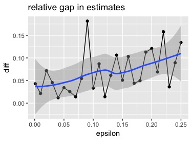
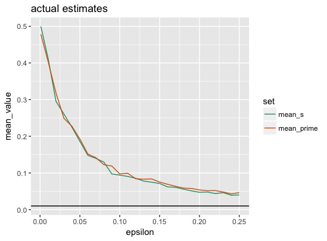

## Differential Privacy
### Code

Presenter: Tai Yang


---

### R in Action

Software: R <br />
Package: diffpriv

---

### Examples

@ol[](false)

- Laplace Privatization of Sample Mean
- Random DP with Exponential Mechanism

@olend

---?color=lavender
@title[Laplace Privatization of Sample Mean]

### Laplace Privatization

```r
library(diffpriv)
f <- function(X) mean(X) ## target function
n <- 100 ## dataset size
## the sensitive database in [0,1]^n
D <- runif(n, min = 0, max = 1)
mechanism <- DPMechLaplace(target = f,
    sensitivity = 1/n, dims = 1)
## desired privacy budget
pparams <- DPParamsEps(epsilon = 1)
r <- releaseResponse(mechanism, privacyParams = pparams,
    X = D)
cat("Private response r$response:", r$response,
    "\nNon-private response f(D): ", f(D))
```

@[1](Load the library)
@[2](Target function)
@[3-5](Generate data)
@[6-11](Privatize the data)
@[12-13](Private response r$response: 0.4593619, Non-private response f\(D\): 0.4761788)


---?color=lavender
@title[Random DP with Exponential Mechanism]

### Exponential Mechanism

```r
## a package that generates representative random names
library(randomNames)
oracle <- function(n) randomNames(n)
D <- c("Michael Jordan", "Andrew Ng", "Andrew Zisserman",
"Christopher Manning", "Jitendra Malik", "Geoffrey Hinton",
"Scott Shenker", "Bernhard Scholkopf", "Jon Kleinberg",
"Judea Pearl")
n <- length(D)
f <- function(X) { ## target function
    function(r) sum(r == unlist(base::strsplit(X, "")))
}
## the response set, letters a--z, must be a list
rSet <- as.list(letters)
mechanism <- DPMechExponential(target = f,
    responseSet = rSet)
mechanism <- sensitivitySampler(mechanism,
    oracle = oracle, n = n, gamma = 0.1)
pparams <- DPParamsEps(epsilon = 1)
r <- releaseResponse(mechanism, privacyParams = pparams,
    X = D)
cat("Private response r$response: ",
    r$response,
    "\nNon-private f(D) maximizer: ",
    letters[which.max(sapply(rSet, f(D)))])
```

@[4-8](Sensitive data)
@[9-11](Target function)
@[12-13]
@[14-20](Privatize the data)
@[1-3](Define oracle for sensitivity sampler)
@[1-3,16-17](Sampler)
@[21-24](Private response r$response: e, Non-private f\(D\) maximizer: e)

---
@snap[north]
### DP Does Work

$A$ is 100 zeros <br />
$A'$ replace a 0 of $A$ with 1
@snapend

@snap[south-west span-48]

@snapend

@snap[south-east span-48]

@snapend

---

### Questions?
